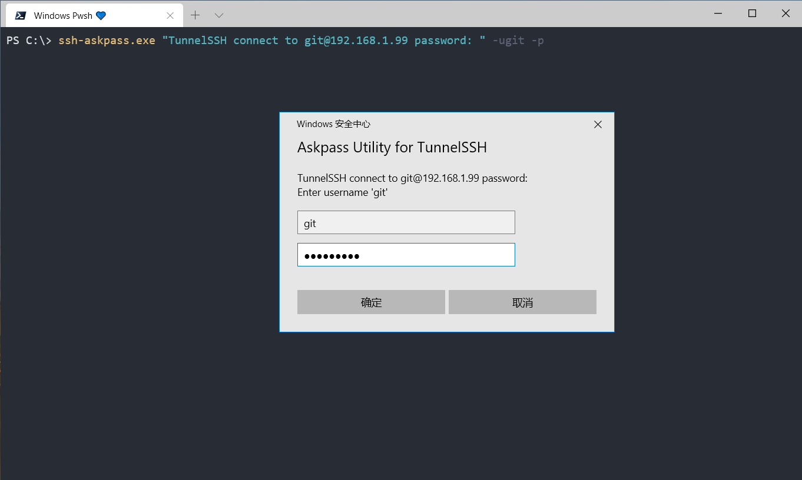

# TunnelSSH a witty SSH client

We are gradually relying on high-speed Internet. Every day, browsing social media, playing games, watching videos, sending and receiving emails, and remote video are inseparable from the Internet. For programmers, the network can solve our coordinated development problems. We can collaborate with people remotely through a distributed version control system, but all this is based on a stable network connection.

The network is complex and changeable, the hardware may fail, the enterprise may add enterprise policy restrictions, the operator may have insufficient link bandwidth, and there may be other factors that prevent the network connection from being established or interrupted. Therefore, there are specific mechanisms to bypass these restrictions and establish special network connections.

When an enterprise isolates an external network, only specific machines are allowed to connect to the external network. At this time, we can establish a connection through a specific machine through a proxy. In the HTTP protocol, we can use the [CONNECT](https://developer.mozilla.org/en-US/docs/Web/HTTP/Methods/CONNECT) method to establish a tunnel, so as to achieve network interoperability.

In OpenSSH, we can use the ProxyCommand setting to allow the OpenSSH client to establish a connection via the Proxy command, but the configuration is fixed. Once the user's network conditions are adjusted, such as closing the proxy, you need to reset it, which has some troubles, so I decided to write TunnelSSH solve this problem. In fact, developing a full-featured SSH client is a bit troublesome, and OpenSSH can set the ProxyCommand, so in TunnelSSH, we also provide the necat command. When OpenSSH sets the ProxyCommand to netcat, netcat will solve the problem of automatically establishing the network according to the system settings. connection. In addition, in the TunnelSSH project, we also provide TunnelSSH git package, SSH AskPass Utility tool, which is the basic content of TunnelSSH.

## Introduction to TunnelSSH

TunnelSSH is both the name of this project and the name of its SSH client. TunnelSSH borrows from [tatsushid/minssh](https://github.com/tatsushid/minssh) related code, is a limited SSH client, mainly to solve the author When using the SSH protocol to manage git repositories, the system proxy cannot be used. A simple screenshot is as follows:


Please note that here I used [baulk](https://github.com/baulk/baulk.git) to install TunnelSSH, and started the baulk terminal environment, so I can directly use `git tunnel -V push` to store The library is pushed to Github.

The implementation of TunnelSSH does not have much technical content. In short, it is based on Golang's TunnelSSH. When establishing an SSH connection, if the agent is available, use the agent to establish `net.Conn`, establish an SSH connection on this basis, and then git packaging command Set the `GIT_SSH` and `GIT_SSH_VARIANT` environment variables to support parsing the SSH command line parameters used by git, and that's it.

## TunnelSSH NetCat

The purpose of the appearance of TunnelSSH NetCat is very simple. Since TunnelSSH does not want to be a powerful SSH client for the time being, NetCat can help OpenSSH become more powerful. NetCat commands and TunnelSSH use the same `tunnel` package, which can read the system configuration ( Windows registry keys) and environment variables. Establish a network connection through the proxy. When the proxy is not available, fall back to the direct connection. When the proxy is not turned on, it is also very simple to establish a direct connection.

## git-tunnel TunnelSSH Git wrapper

git-tunnel initializes the GIT_SSH setting and environment variables by checking the environment configuration and starts the corresponding git command to support related operations. The processing can enable git to establish an SSH connection using TunnelSSH, and can also set environment variables on Windows to allow Git Over HTTP to establish a network through a proxy. Connection, so that you can set the network connection method of the repository without running the `git config`.

Similar commands are as follows ([baulk](https://github.com/baulk/baulk.git) tool is used here to add the directory where git/git-tunnel is located to the environment variable):

```shell
git tunnel clone git@github.com:balibuild/tunnelssh.git
cd tunnelssh
git tunnel -V fetch
```

You can also use it when there is no agent, without any other impact. Bash/Zsh Alias ​​can be set on Linux/macOS, and aliases can also be set in PowerShell.

## SSH AskPass Utility

In TunnelSSH, we use the ssh-askpass command to read password information and prompt confirmation after standard input redirection. Here we use the modern Windows password credential input interface, as shown below:



It should be noted that because of the Vista GUI style, the program needs to be embedded in the application list, so this project needs to be built using [bali](https://github.com/balibuild/bali).

## Known issues

Since the author has no macOS and has not tested reading system proxy settings, on macOS, only the settings in the environment variables can be read. If anyone wants to help the author to achieve this function, welcome to submit a PR.

## Other

Users are welcome to submit PR

## Thanks

ssh RunInteractive borrows from [tatsushid/minssh](https://github.com/tatsushid/minssh). Thanks here
